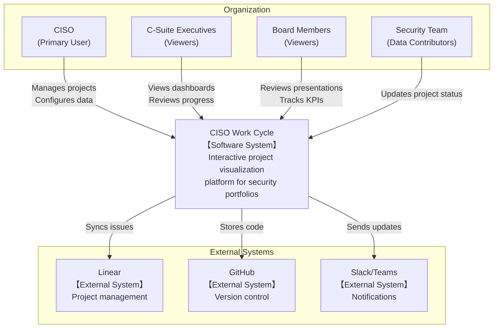
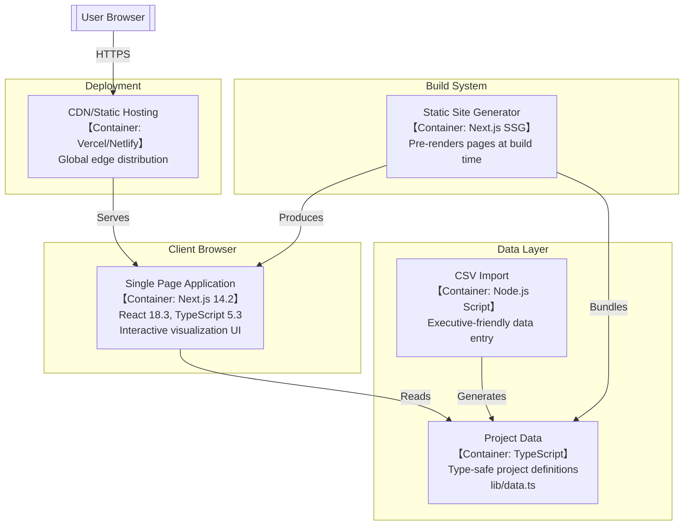
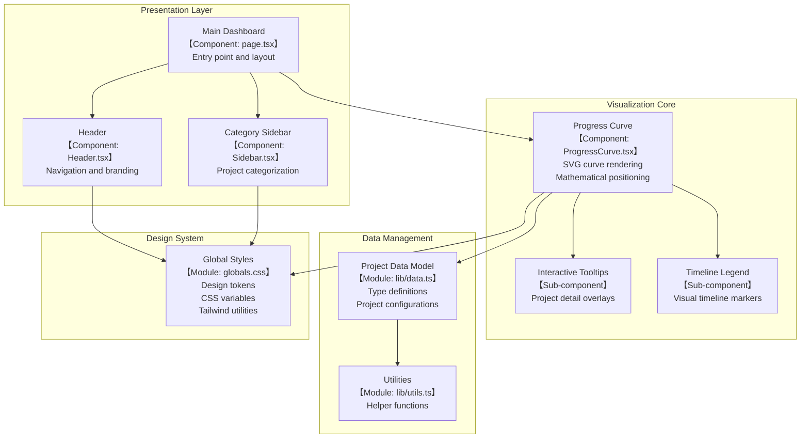
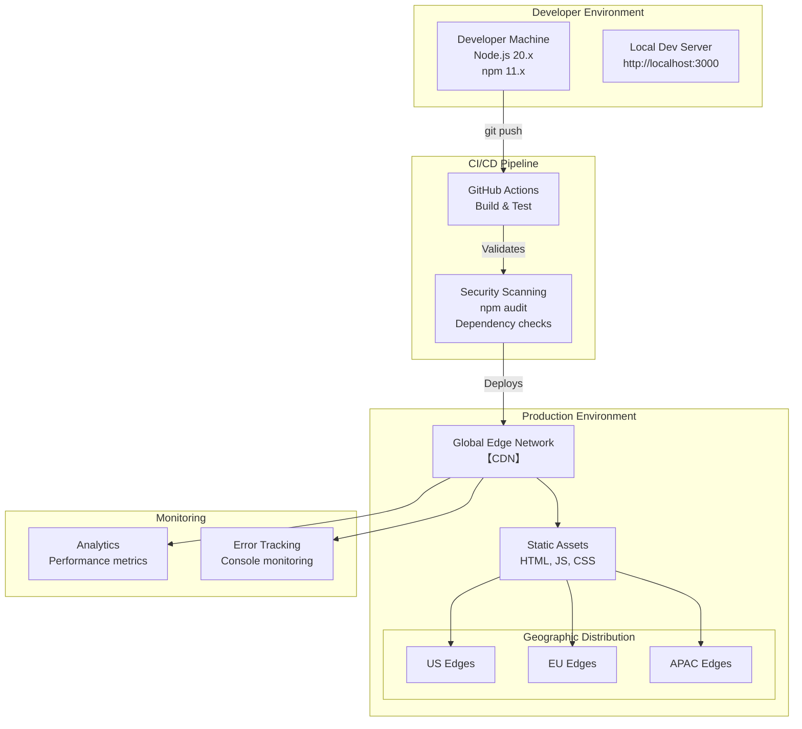
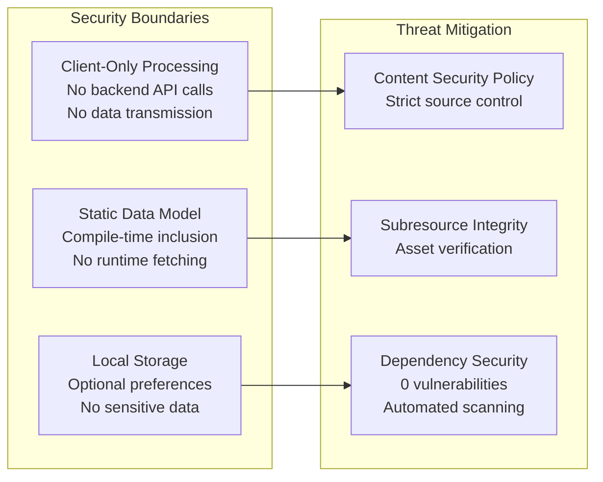
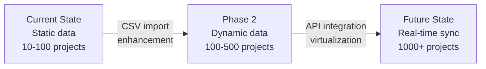
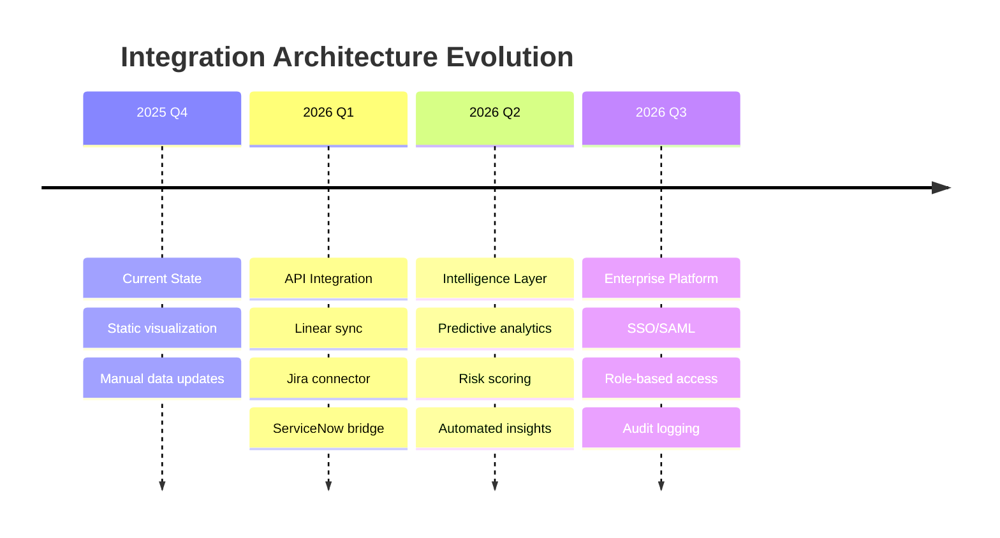

# Architecture Documentation - CISO Work Cycle

## Executive Summary

The CISO Work Cycle is an executive-grade visualization platform that transforms complex cybersecurity project portfolios into intuitive, board-ready presentations using an interactive maturity curve methodology. Built for Chief Information Security Officers to communicate security initiatives, resource allocation, and strategic priorities to C-suite executives and board members.

## C4 Model Architecture

### Level 1: System Context

The highest level view showing how the CISO Work Cycle fits within the organizational ecosystem.



**Key Stakeholders:**
- **CISO**: Primary user who configures projects and presents to executives
- **C-Suite/Board**: Consume visualizations for decision-making
- **Security Team**: Provide project updates and status

### Level 2: Container Diagram

Shows the high-level technical building blocks and their interactions.



**Technology Choices:**
- **Next.js 14.2.33**: Enterprise-grade React framework with security patches
- **TypeScript 5.3.3**: Type safety for mathematical calculations
- **Tailwind CSS**: Rapid, consistent styling system
- **Static Generation**: No backend required, maximum security

### Level 3: Component Diagram

Internal structure of the Single Page Application.



### Level 4: Deployment Diagram

Shows how the system is deployed to production infrastructure.



## Design System Architecture

### Visual Hierarchy

```
Executive Presentation Layer
├── Primary Focus: Progress Curve
│   ├── Mathematical Bezier curves
│   ├── Responsive SVG rendering
│   └── 60fps animation targets
├── Secondary: Project Markers
│   ├── Timeline symbols (○●△▲⊗)
│   ├── Risk/Complexity indicators
│   └── Hover state interactions
└── Supporting: Navigation & Context
    ├── Category sidebars
    ├── Legend system
    └── Tooltip overlays
```

### Responsive Design Architecture

| Breakpoint | Target Device | Optimizations |
|------------|--------------|---------------|
| Base (<700px) | Mobile/Tablet | Simplified curve, larger touch targets |
| Small (700-1100px) | Laptop | Standard curve, balanced information |
| Large (>1100px) | Desktop/Presentation | Full detail, executive display mode |

### SVG Mathematics & Positioning

The core visualization uses parametric Bezier curves with precise mathematical positioning:

```typescript
// Curve Definition (Simplified)
path = `M ${start}
        C ${control1} ${control2} ${point1}
        C ${control3} ${control4} ${point2}
        ...`

// Project Positioning
position: 0.0 - 1.0 along curve path
point = path.getPointAtLength(pathLength * position)
```

**Key Algorithms:**
- **Curve Generation**: Cubic Bezier with 5 control segments
- **Project Placement**: Path length interpolation
- **Responsive Scaling**: Viewport-based coordinate transformation
- **Collision Detection**: Spatial hashing for tooltip positioning

## Executive Requirements Architecture

### Board Presentation Mode

**Performance Requirements:**
- Load time: <2 seconds on corporate networks
- Render time: <100ms for interactions
- Resolution support: 4K displays (3840×2160)
- Print quality: Vector graphics for PDF export

**Accessibility Status:**
- ✅ Color contrast ratios: 4.5:1 minimum (verified for text and badges)
- ✅ Responsive design: Works across screen sizes
- ⚠️ Keyboard navigation: Todo
- ⚠️ Screen reader support: Todo
- ⚠️ ARIA labels: Todo

**Note**: We're actively working toward full WCAG 2.1 AA compliance. Current visual accessibility is good, but functional accessibility for screen readers and keyboard-only users needs enhancement.

### Data Security Architecture



## Technology Decision Rationale

### Core Framework: Next.js 14.2.33

**Selected Over:**
- Angular: Too heavy for visualization-focused app
- Vue: Smaller ecosystem for enterprise components
- Vanilla React: Lacks built-in optimizations

**Rationale:**
- Production-proven in Fortune 500 deployments
- Built-in security headers and CSP support
- Static generation eliminates attack surface
- Automatic code splitting for performance

### Visualization: Native SVG vs Canvas vs WebGL

**Decision: Native SVG**

| Criteria | SVG ✓ | Canvas | WebGL |
|----------|-------|---------|--------|
| Print Quality | Vector | Raster | Raster |
| Accessibility | Native | Manual | Complex |
| Performance (50 items) | Excellent | Good | Overkill |
| Developer Experience | Familiar | Moderate | Complex |
| SEO/Crawlability | Yes | No | No |

### State Management: Local vs Redux vs Zustand

**Decision: React Local State**
- Application is primarily read-only
- Limited state complexity (hover, viewport)
- No need for time-travel debugging
- Reduces bundle size by ~30KB

## Scalability Considerations

### Current Limits
- **Projects**: Optimized for 10-100 items
- **Categories**: 4-10 recommended
- **Viewport**: 320px to 4K displays

### Growth Path



**Phase 2 Enhancements:**
- Dynamic data loading from API
- Virtual scrolling for large datasets
- Progressive rendering for performance

**Future Considerations:**
- WebSocket real-time updates
- Multi-user collaboration
- Historical timeline playback
- AI-powered insights

## Security Architecture

### Dependency Management

```yaml
Strategy: Conservative Updates
- Security patches: Immediate (0-day response)
- Minor versions: Quarterly review
- Major versions: Annual planning
- Breaking changes: Staged migration
```

### Vulnerability Response

1. **Detection**: Automated npm audit in CI/CD
2. **Assessment**: CVSS score evaluation
3. **Remediation**: Patch → Test → Deploy
4. **Validation**: Post-deployment verification

### Client-Side Threat Model

| Threat | Mitigation |
|--------|------------|
| XSS | React sanitization, CSP headers |
| Supply chain | npm audit, SRI, lockfile |
| Data exposure | No sensitive data in client |
| MITM | HTTPS only, HSTS headers |
| Code injection | Static build, no eval() |

## Future Architecture Vision

### Enhanced Executive Features
- **Export System**: PowerPoint, PDF, Keynote integration
- **Annotation Layer**: Executive comments on projects
- **Scenario Modeling**: What-if analysis for resource allocation
- **KPI Dashboard**: Automated metric calculation

### Technical Evolution
- **Micro-frontends**: Modular feature deployment
- **Edge Functions**: Personalization at edge
- **AI Integration**: Natural language project updates
- **Mobile App**: Native iOS/Android for on-the-go access

### Integration Roadmap



## Conclusion

The CISO Work Cycle architecture prioritizes:
1. **Executive Experience**: Board-ready visualizations
2. **Security**: Zero-vulnerability baseline
3. **Performance**: Instant interactions
4. **Maintainability**: Simple, documented patterns
5. **Evolution**: Clear path to enterprise features

This architecture supports both immediate executive presentation needs and long-term evolution into a comprehensive security portfolio management platform.

---

## Related Documentation

- **[Architecture Decision Records](docs/adr/)** - Detailed decision documentation (ADR-001 through ADR-005)
- **[Security Policy](SECURITY.md)** - Vulnerability disclosure and security practices
- **[Contributing Guide](CONTRIBUTING.md)** - Development standards and workflow
- **[Testing Strategy](docs/testing-strategy.md)** - Testing philosophy and coverage requirements
- **[Troubleshooting Guide](docs/troubleshooting.md)** - Common issues and solutions

---

*Architecture documentation following C4 Model by Simon Brown*
*Last Updated: September 2025*
*Next Review: Q1 2026*